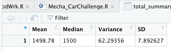
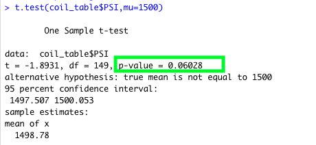

# MechaCar_Statistical_Analysis

## Overview

The purpose of this assignment was to analyze a series of datasets from the automotive industry. The goal was to apply an understanding of statistics and hypothesis testing. Raw data stored in CSVs files was provided for the assignment. In order to effectively analyze the data, the ETL (Extract, Transform, and Load) process was followed.

 All of the statistical analysis and visualizations were written in R programming language using RStudio. The analysis includes visualizations, statistical tests, and interpretation of the results.

## Linear Regression to Predict MPG

The first deliverable required a multiple linear regression analysis to identify which variables in the dataset predict the MPG for vehicle prototypes.
The statistical summary output showed the following:

1. The variables ground_clearance and vehicle_length (as well as the intercept) are statistically 
   **unlikely to provide random amounts of variance** to the linear model. In other words, these variables 
   have a significant impact on the miles per gallon on the MechaCar prototype. As indicated by the green arrows in the image above, 
   a linear regression model run on these variables against figures for MPG returned p-values of 2.60e-12 (2.6 X 10-12) and 5.21e-08 (5.21 X 10-08).

   Further, the intercept is also statistically significant, which could mean that the significant 
   features (ground clearance, vehicle length) may need to be transformed or adjusted to help 
   improve the predictive power of the model.

2. The p-value of the linear model = 5.35e-11 (5.35 X 10-11) (highlighted in in green box) is much smaller than the 
   assumed significance level of 0.05%. Therefore, it can be stated that there is sufficient evidence 
   to **reject our null hypothesis**, which further indicates that the slope of this linear model is **not zero**.

3. The r-squared value of this linear model is 0.7149 (highlighted in blue box), meaning that roughly 71% of all MPG 
   predictions will be correct when using this model. Therefore, we can conclude that this 
   linear model predicts the MPG of MechaCar's  prototypes effectively.

## Summary Statistics on Suspension Coils

For the second deliverable, summary statistics was collected on the pounds per square inch (PSI) of 
the suspension coils from the manufacturing lots.
The summary statistics dataframe showed the following:

1. The mean and median are almost the same (difference 1.22). Hence, we can state that 
   the dataset has a **symmetric** distribution and zero skewness.

2. The standard deviation was 7.89. This indicates that the data points are spread out 
   over a large range of values.

3. The design specifications for the MechaCar suspension coils dictate that the  variance 
   of the suspension coils must **not exceed 100 PSI**. The summary output showed that the overall variance 
   was 62.29 (or 62 pounds) PSI which is below the specified requirement. Therefore, the current 
   manufacturing data meet the design specification. However, the variance for Lot 3 (highlighted in green box), 
   is well above the specified threshold (170.29), which does not meet the the design specification.

## T-Tests on Suspension Coils

For the third deliverable, one-sample t-tests were performed to determine if all manufacturing lots and each lot individually were statistically different from the population mean of 1500 PSI. 

#### All Lots

- The results of the T-test for the suspension coils for all manufacturing lots showed that they are not statistically different from the population mean of 1500 PSI. The p-value = 0.0603  (highlighted in green box). Assuming the significance level of 0.05%, it can be stated that there was **not sufficient evidence** to reject our null hypothesis.

#### Lot 1

- The results of the T-test for the suspension coils for Lot 1 showed that they are not statistically different from the population mean of 1500 PSI. The p-value = 1 (highlighted in green box). A p-value generally is not found to be 1; however, when values on both groups are the same, the p-value becomes 1 (0.99). Assuming the significance level of 0.05%, it can be stated that there was **not sufficient evidence** to reject our null hypothesis.

#### Lot 2

- The results of the T-test for the suspension coils for Lot 2 showed that they are not statistically different from the population mean of 1500 PSI. The p-value = 0.6072 (highlighted in green box). Assuming the significance level of 0.05%, it can be stated that there was **not sufficient evidence** to reject our null hypothesis.

#### Lot 3

- The results of the T-test for the suspension coils for Lot 3 showed that **there is a slight statistically difference** from the population mean of 1500 PSI; however, the p-value = 0.04168 (highlighted in green box). Assuming the significance level of 0.05%, it can be stated that there was **not sufficient evidence** to reject our null hypothesis.

## Study Design: MechaCar vs Competition

When consumers evaluate the decision of purchasing a new car, there are many factors that they take into consideration. Depending on where the consumer lives (e.g., city or suburbs), they consider buying a car that serves their particular needs. If a consumer lives in the city, where ride-sharing services are abundant, they may look into buying an economical and reliable car to transport themselves instead of using public transportation. If they live in the suburbs, they may look for more features in a car to make their possible long trips more comfortable. At the end of the day, most consumers purchase a car based on practicality, and analyze the car from top to bottom to ensure it will be worth the investment.

### Metric to Test

The focus of our test would be to evaluate MechaCar's city and highway fuel efficiency in comparison to various competitors' vehicles.

### Null or Alternative Hypothesis

H0 : Mechacar prototypes' city and highway fuel efficiency is similar to the competitor's vehicle in the same class.

Ha : MechaCar prototypes' average city and highway fuel efficiency is statistically above or below the competitor's vehicles.

### Statistical Test Used for Hypothesis

The best statistical test to test our hypothesis would be the two-sample t-test method. This t-test is widely used to test whether the unknown population means of two groups are equal or not. In addition, the ggplot2 library would be used to create a boxplot and show the potential spread between diffrent vehicles.

### Data Needed to Run Statistical Test
 Fuel efficiency data from 25 to 40 individual cars would be a suitable choice to create a sample size of data for each car in the class type. 

